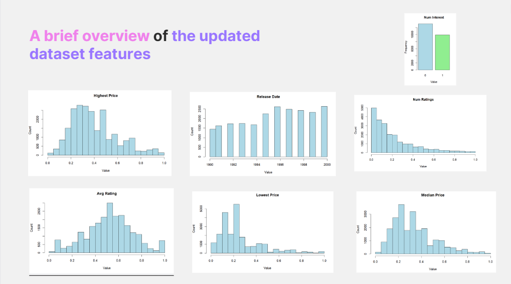
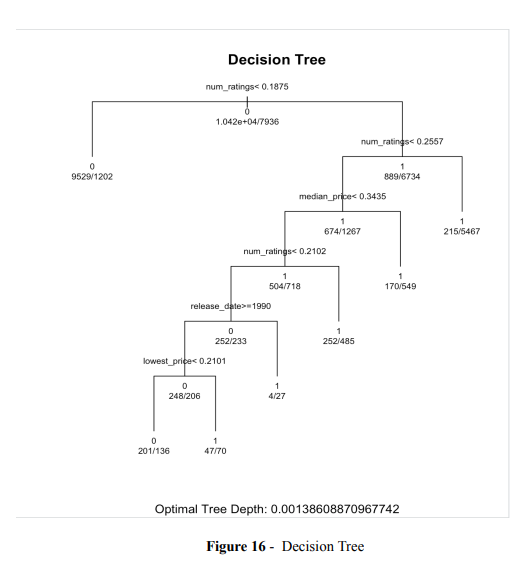
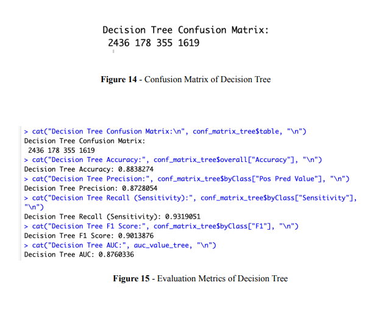
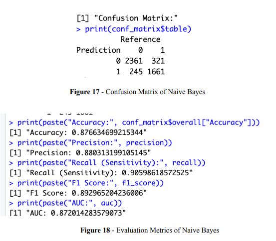
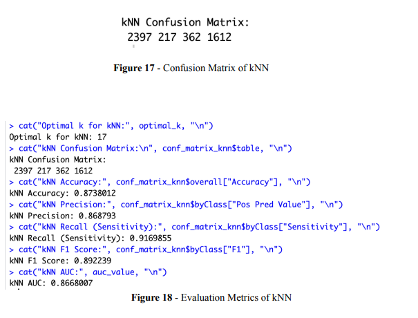

https://www.kaggle.com/datasets/justinpakzad/discogs-electronic-music-dataset-1990-2000/data
# Project Title: Music Release Classification

## Table of Contents

1. [Introduction](#introduction)
2. [Data Overview and Pre-processing](#data-overview-and-pre-processing)
   1. [Feature’s Description](#features-description)
   2. [Column Selection](#column-selection)
   3. [Handling Missing Values and Zero Entries](#handling-missing-values-and-zero-entries)
   4. [Data Type Conversion](#data-type-conversion)
   5. [Derived Features](#derived-features)
      - [Why "num_interest" as a Target Feature?](#why-num_interest-as-a-target-feature)
   6. [Outlier Removal](#outlier-removal)
   7. [Normalization](#normalization)
   8. [Target Variable Conversion](#target-variable-conversion)
   9. [Conclusion of Data Overview and Pre-Processing](#conclusion-of-data-overview-and-pre-processing)
3. [Classification Methods](#classification-methods)
   1. [Decision Tree](#decision-tree)
   2. [Naive-Bayes](#naive-bayes)
   3. [kNN](#knn)
4. [Conclusion](#conclusion)
5. [Code](#code)

## Introduction
This project focuses on employing machine learning to address a classification task using a real-world dataset related to music releases. The goal is to predict the interest level of a music release, quantified by the variable 'num_interest,' derived from the sum of 'have' and 'want' values. The report begins with an exploration of the dataset, highlighting its structure and characteristics, followed by essential pre-processing steps and implementation of three machine learning models: Decision Tree, Naive-Bayes, and K-Nearest Neighbors (KNN).

## Data Overview and Pre-processing

The dataset contains information related to music releases, including various attributes such as artist, title, label, country, format, release date, genre, styles, and pricing details. The pre-processing steps include:

### Features Description

- **artist:** The artist(s) associated with the music release.
- **title:** The title of the music release.
- **label:** The record label associated with the release.
- **country:** The country of origin or release.
- **format:** The format in which the music release is available (e.g., CD, vinyl).
- **release_date:** The date when the music release occurred.
- **genre:** The genre classification of the music.
- **styles:** The styles associated with the music release.
- **have:** The number of users indicating they have the release.
- **want:** The number of users expressing a desire to acquire the release.
- **num_ratings:** The total number of ratings received for the release.
- **average_rating:** The average rating given by users.
- **lowest_price:** The lowest price at which the release is available.
- **median_price:** The median price of the release.
- **highest_price:** The highest price at which the release is available.

### Column Selection

The initial step involved carefully selecting relevant columns for analysis. Columns such as "artist," "title," "label," "country," "styles," "format," and "genre" were identified as non-contributory to the immediate analysis and were therefore removed from the dataset.

### Handling Missing Values and Zero Entries

To maintain data quality, rows with zero or missing values in critical columns such as "num_ratings," "lowest_price," "median_price," and "highest_price" were excluded to prevent potential biases.

### Data Type Conversion

Numeric conversion was applied to columns like "release_date," "average_rating," and pricing columns ("lowest_price," "median_price," "highest_price") to facilitate numerical analysis.

### Derived Features

A new feature, "num_interest," was introduced to quantify the overall interest in a release. This feature was derived by summing the "have" and "want" columns, reflecting the combined interest of users in possessing a particular release.

#### Why "num_interest" as a Target Feature?

“num_interest” reflects user engagement and desire for a release, making it a pertinent target for classification. The binary outcome (0 or 1) simplifies the task for classification models, distinguishing between releases with low and high interest.

### Outlier Removal

Outliers in certain columns were identified and eliminated using the interquartile range (IQR) method.

### Normalization

To ensure that features are on a comparable scale, min-max normalization was applied to selected columns, including "num_ratings," "average_rating," "lowest_price," "median_price," and "highest_price."

### Target Variable Conversion

The target variable, "num_interest," was converted to a factor to prepare it for classification modeling.

### Conclusion of Data Overview and Pre-processing

In conclusion, the detailed pre-processing steps outlined in this section aimed to refine and prepare the dataset for subsequent analysis. The careful selection of columns, handling of missing values, data type conversions, feature engineering, outlier removal, normalization, and target variable conversion collectively contribute to a dataset that is more amenable to exploratory data analysis and modeling tasks.

## Classification Methods

This study focuses on constructing a model utilizing Naive Bayes, k-NN, and Decision Tree classification algorithms, with a subsequent evaluation of their performance. Through meticulous pre-processing and dataset editing, the study aims to enhance the effectiveness and accuracy of the models.

### Decision Tree

We partitioned our dataset, reserving 80% for training the model and keeping the remaining 20% for testing purposes. The model was trained using the train function, employing recursive partitioning as the chosen method. Cross-validation techniques were incorporated during the training process to enhance the model's generalization capabilities.

### Naive-Bayes

We reserved 80% of our dataset for training the model and the remaining 20% for testing purposes. The model was trained using the train function, applying recursive partitioning, and incorporating cross-validation techniques.

### kNN

We divided our dataset, allocating 80% for training purposes and reserving the remaining 20% for testing the model's performance. The model training utilized the train function with the k-Nearest Neighbors (kNN) method, and hyperparameter tuning was performed through cross-validation.

## Conclusion

This study aimed to build a model using Naive Bayes, k-NN, and Decision Tree classification algorithms and evaluate the performance of these models. The Decision Tree model showed high performance, while both Naive Bayes and kNN models also exhibited successful results. The choice of the model depends on the specific problem and dataset characteristics.
To run the code, Adjust the file path accordingly.
